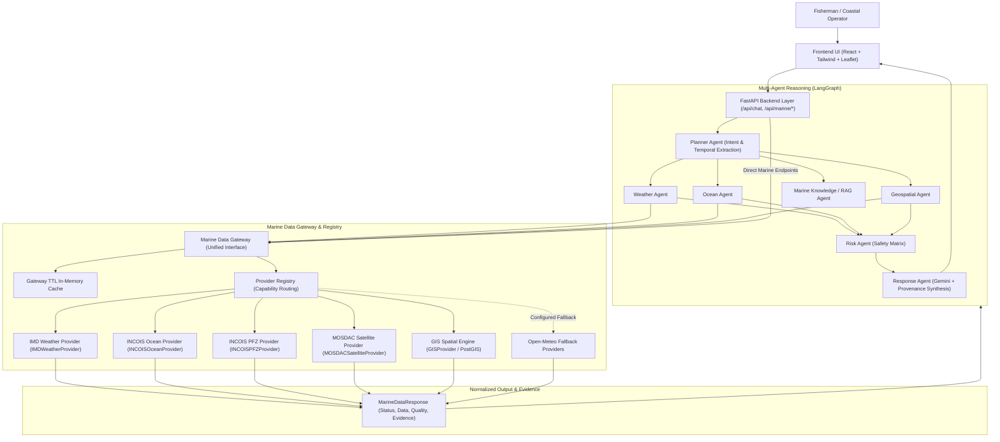

# MARINEX AI — Marine Data Foundation & Marine Data Gateway Architecture

## 1. Overview & Objective

Phase 5A establishes the **Marine Data Foundation and Marine Data Gateway** for the **MARINEX AI** decision support system. Prior to this phase, agents accessed external weather and ocean APIs directly or relied on basic mocked services. 

Phase 5A abstracts all underlying telemetry and geospatial data providers behind a **Provider-Agnostic Marine Data Gateway**. This provides:
- **Zero Hallucination of Credentials or Live Telemetry**: Providers without valid credentials strictly report `NOT_CONFIGURED` or `UNAVAILABLE`. Mock or sample data is never falsely claimed as live.
- **Unified Domain Models**: Strictly typed Pydantic V2 models (`WeatherData`, `OceanData`, `PFZData`, `SatelliteData`, `GeospatialData`, `HazardData`, `MarineEvidence`, `MarineDataPoint`, `MarineDataResponse`).
- **Provider Registry**: Dynamic capability-to-provider binding supporting primary routes (IMD, INCOIS, MOSDAC, GIS) and operational fallbacks (Open-Meteo).
- **Audit Provenance & Evidence**: Every response encapsulates a full `MarineEvidence` trail with retrieval timestamps, source dataset references, confidence scores, and verification status.
- **Backward Compatibility**: Fully preserves Phase 1–4 functionality (multi-turn chatbot, Leaflet maps, LangGraph orchestration, RAG, REST endpoints).

---

## 2. End-to-End Pipeline & Data Flow

The following sequence details how a query or telemetry request flows from user interaction through multi-agent reasoning to raw marine data providers and back:

---

## 3. Rationale for Isolating Agents Behind the Gateway

### 3.1 Decoupling Reasoning from Telemetry Ingestion
- **The Problem**: If individual LangGraph agents (`WeatherAgent`, `OceanAgent`, `RiskAgent`) handle raw HTTP queries, provider authentication, rate limits, and custom response schemas directly, any change in an external vendor's API breaks the agent graph.
- **The Gateway Solution**: Agents query high-level domain concepts (e.g. `gateway.get_weather(location, time_window)`). The agent remains entirely unaware whether the backend provider is IMD AWS, Open-Meteo, ECMWF, or a local PostGIS cache.

### 3.2 Elimination of Data Hallucination
- Unconfigured enterprise marine providers (such as IMD FTP/REST, INCOIS OPeNDAP, ISRO MOSDAC) do **not** fail silently or fabricate synthetic "live" figures.
- Instead, the gateway returns a normalized `MarineDataResponse` with `status: NOT_CONFIGURED` or `UNAVAILABLE`, accompanied by clear explanatory metadata.
- Agents inspect `status` and `evidence` to transparently disclose data origin to coastal operators and fishers.

### 3.3 Transparent Caching & Rate Limit Protection
- Oceanographic forecasts (e.g., INCOIS wave models) update every 3 to 6 hours; satellite passes update every 12 to 24 hours.
- The Marine Data Gateway implements a thread-safe, TTL-based caching layer partitioned by coordinate bins and time windows, preventing redundant API calls and mitigating external rate limits.

### 3.4 Resilient Failover & Multi-Provider Redundancy
- The `ProviderRegistry` maps capabilities (`WEATHER`, `OCEAN`, `PFZ`, `SATELLITE`, `GEOSPATIAL`) to primary and secondary adapters.
- If a primary provider experiences downtime or network timeouts, the Gateway automatically falls back to secondary operational endpoints while logging the status degradation.

### 3.5 Security & Secret Sanitization
- API credentials (IMD keys, INCOIS tokens, MOSDAC logins) reside exclusively within provider instances instantiated through environment settings.
- Diagnostic endpoints such as `GET /api/marine/gateway/status` expose provider health and configuration flags without ever revealing sensitive tokens or secrets.

---

## 4. Marine Data Models Reference (`app.marine_models`)

| Model | Description | Core Attributes |
|---|---|---|
| `DataStatus` | Permitted status enum | `DEMO`, `SIMULATED`, `EXTERNAL`, `VERIFIED`, `NOT_CONFIGURED`, `UNAVAILABLE`, `ERROR` |
| `Location` | Marine point location | `latitude`, `longitude`, `name`, `port`, `country` |
| `BoundingBox` | Spatial boundary query | `min_lat`, `min_lon`, `max_lat`, `max_lon` |
| `TimeWindow` | Temporal observation window | `start_time`, `end_time`, `context` |
| `MarineEvidence` | Provenance record | `source_provider`, `source_dataset`, `retrieval_timestamp`, `confidence_score`, `verification_status` |
| `MarineDataPoint` | Granular telemetry element | `parameter`, `value`, `unit`, `latitude`, `longitude`, `timestamp`, `quality` |
| `MarineDataResponse` | Standardized envelope | `status`, `provider`, `dataset`, `location`, `data`, `quality`, `evidence` |
| `WeatherData` | Meteorological domain payload | `temperature`, `wind_speed`, `wind_direction`, `rain_probability`, `storm_risk` |
| `OceanData` | Hydrodynamic domain payload | `sst`, `chlorophyll`, `wave_height`, `swell_period`, `ocean_condition`, `suitability` |
| `PFZData` | Potential Fishing Zones | `zones: List[PFZFeature]`, `favorable_count`, `source_reference` |
| `SatelliteData` | Remote sensing product | `product_name`, `satellite_name`, `resolution_km`, `status` |
| `GeospatialData` | Maritime zone constraints | `distance_to_shore_km`, `nearest_port`, `restricted_zone`, `marine_protected_area` |
| `HazardData` | Hazard & advisory compilation | `active_cyclones`, `high_wave_alerts`, `advisories` |

---

## 5. REST Endpoints Summary

| Endpoint | Method | Description |
|---|---|---|
| `/api/marine/weather` | `GET` | Meteorological parameters via Marine Data Gateway (IMD primary) |
| `/api/marine/ocean` | `GET` | Hydrodynamic & sea state parameters (INCOIS-Ocean primary) |
| `/api/marine/pfz` | `GET` | Potential Fishing Zones advisory data (INCOIS-PFZ primary) |
| `/api/marine/satellite` | `GET` | Satellite earth observation telemetry (MOSDAC primary) |
| `/api/marine/geospatial` | `GET` | Maritime boundaries, ports, and navigational constraints |
| `/api/marine/gateway/status` | `GET` | Sanitized operational health and provider readiness matrix |

---

## 6. Verification and Compliance

- **Unit & Integration Suite**: `backend/tests/test_marine_gateway_phase5a.py` verifies all data models, provider adapters, unconfigured guardrails, registry dispatching, and REST endpoints.
- **Phase 1-4 Compatibility**: Existing chatbot routes, LangGraph workflow execution, and Leaflet map rendering remain fully functional.
- **Phase 5B Readiness**: The gateway foundation is ready for direct live ingestion pipelines without requiring modifications to agent logic or frontend components.
